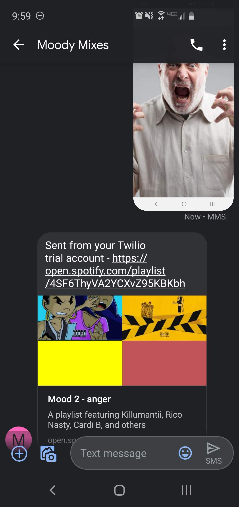
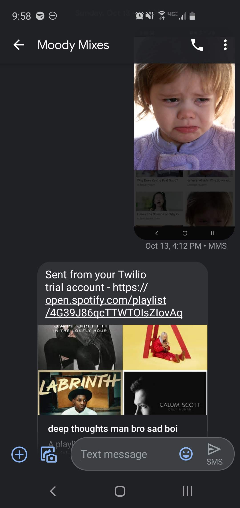

# Moody Mixes

## Setup 
Replace the client credentials in query.py to with your own (these can be found in your spotify developer portal) and setup your twilio 
account. Then run main.py. 

## Demonstration

With an angry face:

With a sad face:

